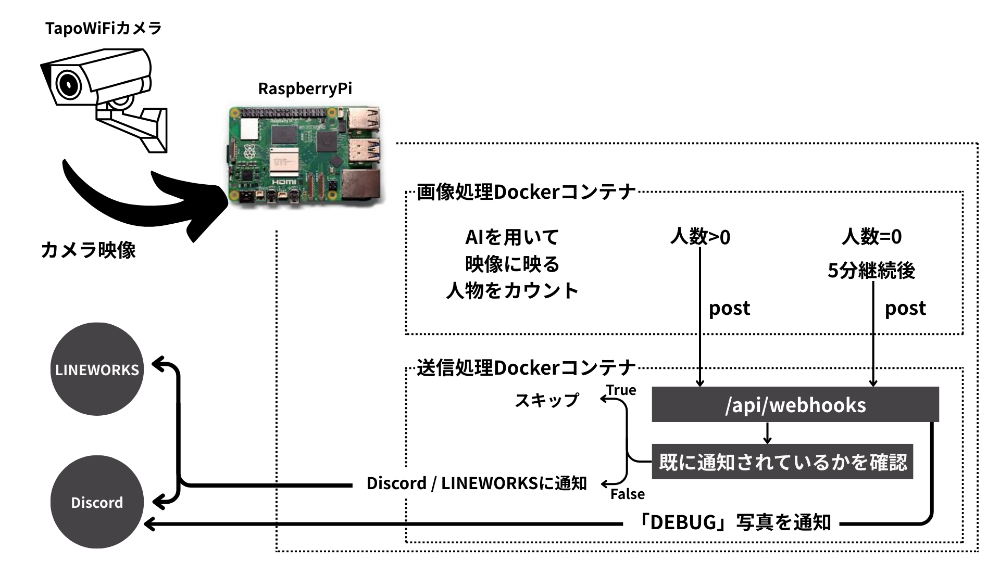

Wi-Fiカメラのデータと物体検出アルゴリズム「YOLO」を用いた、在室通知サービスです。

Presence confirmation service using Wi-Fi cameras and AI.

## 1.機能
 - 在室時 : 
   - WiFiカメラの映像を元に、在室者数をカウントし、Discordに通知します。
   - 在室者数をカウントするために、YOLOv5を使用しています。
 - 不在時 :
   - WiFiカメラの映像を元に、在室者数をカウントし、5分間不在であれば、Discordに通知します。

## 2.対応連絡ツール
  - [x] Discord
  - [x] LINEWORKS (掲示板)

## 3.環境変数
 - VIDEO_PATH : `WiFiカメラの映像のURL`
 - DISCORD_WEBHOOK_URL : `Discordの通知先チャンネルのWebhookURL`
 - API_HOST : `APIのホスト名`
 - API_PORT : `APIのポート番号`
 - API_TOKEN : `任意の文字列`
 - LW_API_20_CLIENT_ID : `LINEWORKSのAPIクライアントID`
 - LW_API_20_CLIENT_SECRET : `LINEWORKSのAPIクライアントシークレット`
 - LW_API_20_SERVICE_ACCOUNT_ID : `LINEWORKSのAPIサービスアカウントID`
 - PHOTO_ID_OPEN: `Google Driveにある LINEWORKS投稿時の写真のファイルID`
 - PHOTO_ID_CLOSE: `Google Driveにある LINEWORKS投稿時の写真のファイルID`

## 4.概要図

## 5.動作環境
 - Python 3.10.12
 - Docker 28.1.1, build 4eba377
 - Docker Compose v2.35.1

## 6.使用ライブラリ
 - ultralytics
 - opencv-python
 - numpy
 - matplotlib
 - python-dotenv
 - fastapi
 - requests
 - uvicorn
 - schedule
 - pyjwt
 - cryptography
